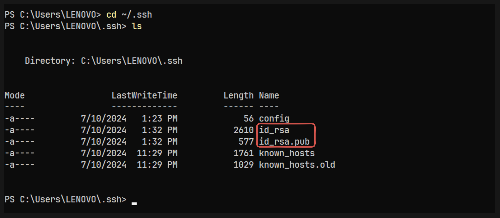

# Create AWS infrastucture using PULUMI js

In this lab, we will create and configure aws infrastructure using pulumi js. Here is the step by step guide:


## Step 01: Set Up Pulumi

- Create a new PULUMI project in the root directory of your project

    ```sh
    mkdir Infra
    cd Infra
    pulumi new aws-javascript
    ```
- After creating the pulumi project configure with the project name, stact selection etc

## Step 02: Write PULUMI js code

- Install Pulumi AWS SDK
    ```sh
    npm install @pulumi/aws
    ```
- Modify index.js to Create Resources

    ```js
    "use strict";
    const pulumi = require("@pulumi/pulumi");
    const aws = require("@pulumi/aws");
    const path = require("path");

    // Read the public key from the local file
    const publicKey = process.env.PUBLIC_KEY;

    if (!publicKey) {
        throw new Error("PUBLIC_KEY environment variable is not set");
    }

    // Create the EC2 KeyPair using the public key
    const keyPair = new aws.ec2.KeyPair("my-key-pair", {
        keyName: "my-key-pair",
        publicKey: publicKey,
    });

    // Create a VPC
    const vpc = new aws.ec2.Vpc("my-vpc", {
        cidrBlock: "10.0.0.0/16",
        enableDnsHostnames: true,
        enableDnsSupport: true,
        tags: {
            Name: "my-vpc",
        },
    });

    // Create an Internet Gateway
    const internetGateway = new aws.ec2.InternetGateway("igw", {
        vpcId: vpc.id,
        tags: {
            Name: "igw",
        },
    });

    // Create a Public Subnet
    const publicSubnet = new aws.ec2.Subnet("public-subnet", {
        vpcId: vpc.id,
        cidrBlock: "10.0.1.0/24",
        availabilityZone: "ap-southeast-1a", // Change this to your desired AZ
        mapPublicIpOnLaunch: true,
        tags: {
            Name: "public-subnet",
        },
    });

    // Create a Route Table
    const routeTable = new aws.ec2.RouteTable("public-rt", {
        vpcId: vpc.id,
        routes: [
            {
                cidrBlock: "0.0.0.0/0",
                gatewayId: internetGateway.id,
            },
        ],
        tags: {
            Name: "public-rt",
        },
    });

    // Associate the Route Table with the Public Subnet
    new aws.ec2.RouteTableAssociation("route-table-association", {
        subnetId: publicSubnet.id,
        routeTableId: routeTable.id,
    });

    // Create a Security Group
    const securityGroup = new aws.ec2.SecurityGroup("security-group", {
        description: "Allow inbound HTTP and SSH traffic",
        vpcId: vpc.id,
        ingress: [
            {
                protocol: "tcp",
                fromPort: 22,
                toPort: 22,
                cidrBlocks: ["0.0.0.0/0"],
            },
            {
                protocol: "tcp",
                fromPort: 80,
                toPort: 80,
                cidrBlocks: ["0.0.0.0/0"],
            },
        ],
        egress: [
            {
                protocol: "-1",
                fromPort: 0,
                toPort: 0,
                cidrBlocks: ["0.0.0.0/0"],
            },
        ],
    });

    // Create an EC2 instance
    const ec2Instance = new aws.ec2.Instance("my-ec2-instance", {
        instanceType: "t2.micro",
        vpcSecurityGroupIds: [securityGroup.id],
        ami: "ami-060e277c0d4cce553", // change the value accordingly with your desired ami-id
        subnetId: publicSubnet.id,
        keyName: keyPair.keyName, // Reference the created key pair
        tags: {
            Name: "Nextjs-Nodejs",
        },
    });

    exports.publicIp = ec2Instance.publicIp;
    ```
## Step 03: Generate key for Instance

Run the following command locally:

```sh
ssh-keygen
```
This will generate two files, typically in the `~/.ssh` directory:

1. id_rsa (private key)
2. id_rsa.pub (public key)

Here is the files in .ssh directory:



## Step 04: Create github secrets:

Go to your GitHub repository > Settings > Secrets and variables > Actions. Add the following secrets:

- PULUMI_ACCESS_TOKEN    --> Your pulumi access token
- AWS_ACCESS_KEY_ID      --> Your aws access key id
- AWS_SECRET_ACCESS_KEY  --> Your aws secret access key
- PUBLI_KEY              --> Your generated id_rsa.pub


## Step 05: Set Up GitHub Actions

- Create `.github/workflows/deploy.yml`

    ```yml
    name: Deploy Infrastructure

    on:
    push:
        branches:
        - main
        paths:
        - Infra/**

    jobs:
    deploy:
        runs-on: ubuntu-latest

        steps:
        - name: Checkout code
            uses: actions/checkout@v3

        - name: Set up Node.js
            uses: actions/setup-node@v2
            with:
            node-version: 'lts/*'

        - name: Install Pulumi CLI
            run: npm install -g pulumi

        - name: Configure AWS credentials
            uses: aws-actions/configure-aws-credentials@v2
            with:
            aws-access-key-id: ${{ secrets.AWS_ACCESS_KEY_ID }}
            aws-secret-access-key: ${{ secrets.AWS_SECRET_ACCESS_KEY }}
            aws-region: ap-southeast-1

        - name: Set public key as github env
            run: echo "PUBLIC_KEY=${{ secrets.PUBLIC_KEY }}" >> $GITHUB_ENV

        - name: Pulumi login
            env:
            PULUMI_ACCESS_TOKEN: ${{ secrets.PULUMI_ACCESS_TOKEN }}
            run: pulumi login

        - name: Install project dependencies
            run: npm install
            working-directory: Infra

        - name: Select Pulumi stack
            run: pulumi stack select <YOUR_STACK_NAME> --cwd Infra

        - name: Refresh Pulumi stack
            run: pulumi refresh --yes --cwd Infra

        - name: Deploy infrastructure with Pulumi
            run: pulumi up --yes --cwd Infra
    ```

    Rememeber to change the <YOUR_STACK_NAME> with your stack name.

## Step 06: Push Changes to GitHub
```sh
git add .
git commit -m "Initial Pulumi setup"
git push origin main
```
This setup will create a VPC, a public subnet with the necessary route tables and gateways, and a EC2 instance within that subnet using `Pulumi.js` and GitHub Actions for CI/CD.

If we got to github `repository > Actions` we can see the workflow that we created running. We can also see the details by clicking it:


## Step 07: Verify the Infrastructure in PULUMI and AWS

- Goto the Pulumi website or you can get the your pulumi stack list using this command:

    ```sh
    pulumi stack ls
    ```

    You will get your pulumi project. Goto the link provided along with the project stack.

    

    Here we can see the resouces that are created.

    

- Here is the resource map:

    

So, we have created and configured AWS infrastructure using pulumi js. In the next lab, we will deploy a Nextjs application